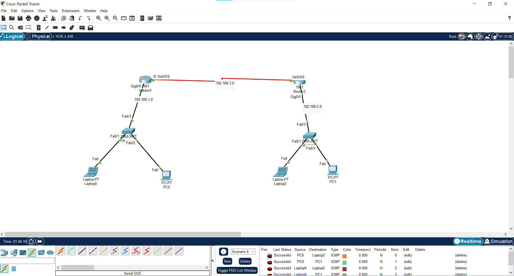
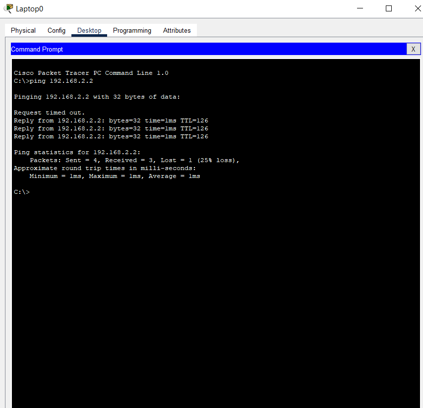

# Configure OSPF and DHCP (simple task)
## OSPF (Open Shortest Path First)
- is a link-state routing protocol that is used to find the best path between the source and the destination router using its own Shortest Path First
## DHCP (Dynamic Host Configuration Protocol)
- is a client/server protocol that automatically provides an Internet Protocol (IP) host with its IP address and other related configuration information such as the subnet mask and default gateway.
## view ping

